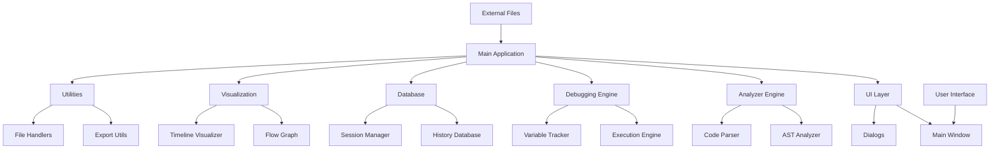

# Code Analysis and Debugging Visualizer - Architecture

```mermaid
graph TD
    A[Main Application] --> B[UI Layer]
    A --> C[Analyzer Engine]
    A --> D[Debugging Engine]
    A --> E[Database]
    A --> F[Visualization]
    A --> G[Utilities]
    
    B --> B1[Main Window]
    B --> B2[Dialogs]
    
    C --> C1[AST Analyzer]
    C --> C2[Code Parser]
    
    D --> D1[Execution Engine]
    D --> D2[Variable Tracker]
    
    E --> E1[History Database]
    E --> E2[Session Manager]
    
    F --> F1[Flow Graph]
    F --> F2[Timeline Visualizer]
    
    G --> G1[Export Utils]
    G --> G2[File Handlers]
    
    H[External Files] --> A
    I[User Interface] --> B1
```